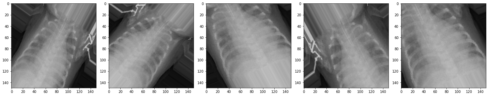
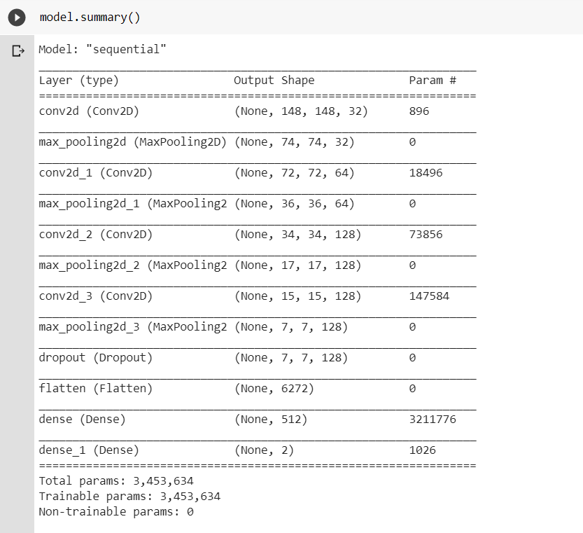
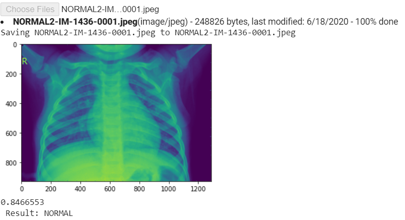
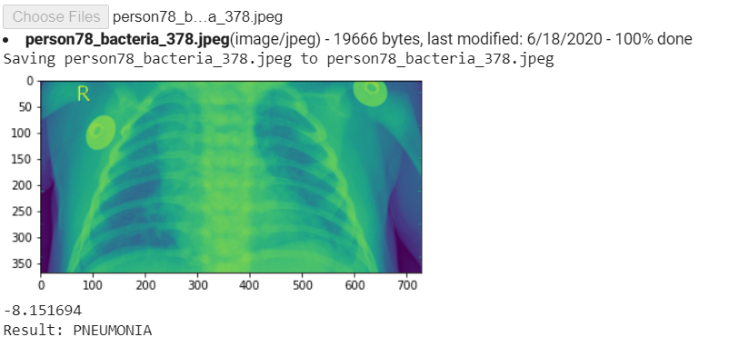
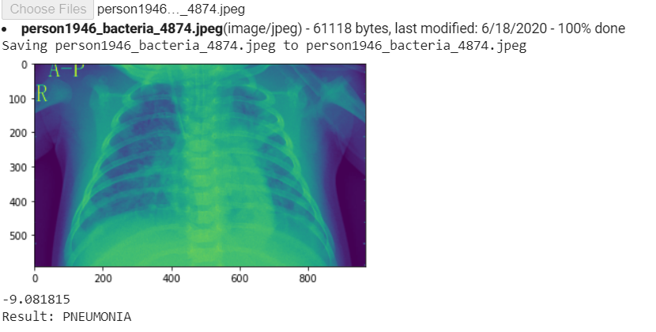
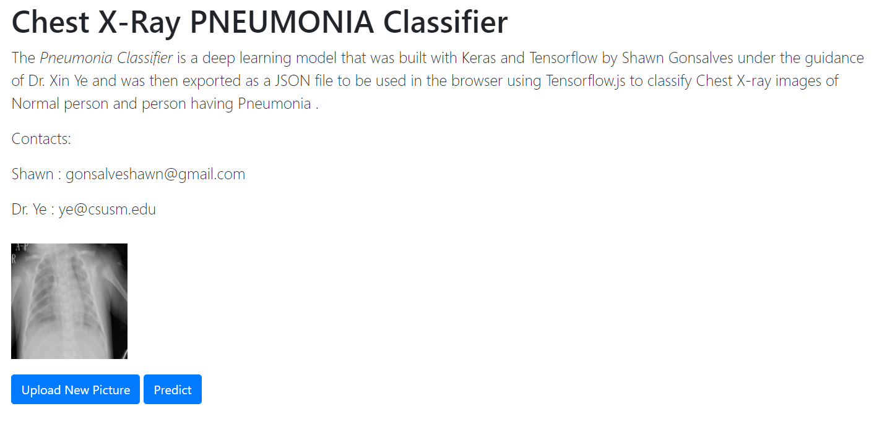
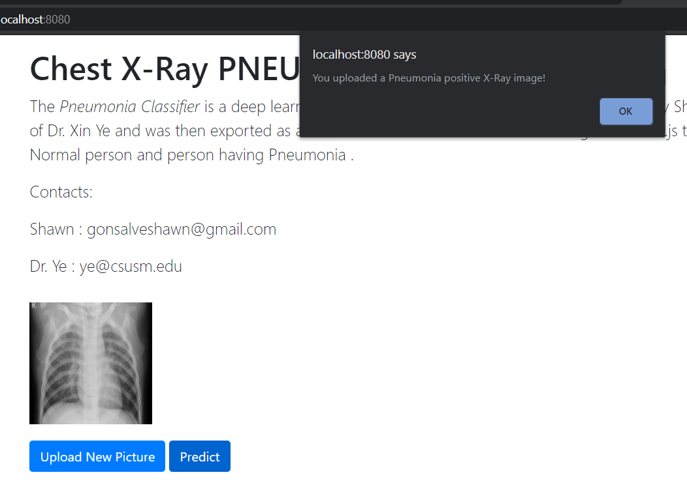

# Using CNN and Tensorflow to detect the presence of Pneumonia in a patient

# Abstract
This study proposes a Convolutional Neural Network model that detects the presence of Pneumonia in a patient based on his/ her X-Ray images. The model is trained from scratch using Python and different libraries associated with Python, so it separates itself from the already pre-trained models. A chest x-ray is the best test for diagnosing pneumonia. The diagnosis of Pneumonia disease is a human-dependent study. [1]An x-ray exam will allow your doctor to see your lungs, heart, and blood vessels to help determine if the person suffers from pneumonia. When interpreting the x-ray, the radiologist will look for white spots in the lungs (called infiltrates) that identify an infection.  Having a model that detects this presence eliminates the two types of human error, which are Mistakes and Violations.  Once the model is trained with a sufficient number of training images of both Normal and Pneumonia X-rays, then the prediction for a new image is made within a matter of seconds. The trained Convolutional neural network model is then exported as a JSON model for deployment on the browser. The deployment process is done using HTML and Javascript, where the model is first fed into the browser, and then a frontal X-ray image is uploaded for inference. The model predicts if it belongs to the Normal or the Pneumonia positive class.

# Introduction
Pneumonia is a disease that infects the lungs and is caused by bacteria, viruses, or fungi. The early diagnosis of this disease is the key to prevent the spread of pneumonia throughout the body. 
We need a system that detects the presence of this disease at a rate that is as fast as the Radiologists, if not more and something which is easily available to the end-user. In the proposed technique We implement the concept of Artificial neural networks to develop a Machine Learning model which is a computational model that is inspired by the way biological neural networks in the human brain process information. ANN’s have proven to be the breakthrough in the ML industry by portraying their prowess in the fields of Speech Recognition, Computer Vision as well as text processing. 
The input for the model is images of frontal-view of chest X-rays, and it outputs either of the two values, i.e., If the image represents Normal Chest X-Ray or Pneumonia positive X-ray image. The deployment of the model on the browser eases the work of the end-user as he/she just has to upload the chest X-ray image on the browser and the browser will predict the class of the image(Normal/Pneumonia).

# Background
Pneumonia can lead to the death of the infected person, due to the impotence of exchanging gas in the lungs. This disease mainly affects infants and young children and adults over the age of 65. Nearly 4 million people die every year, and as low as 420 million people get infected by this disease. The diagnosis of this disease is very crucial, especially detecting it early. The best method in diagnosing the disease is using X-Ray images of the patients. This diagnosis of Chest X-ray images of the affected patients is done by expert radiologists. Radiology is the study of dealing with X-rays and other high-energy radiation, especially the use of such radiation for the diagnosis and treatment of disease.  The examination of X-Ray images helps in determining if you have any complications related to pneumonia, such as abscesses or pleural effusions (fluid surrounding the lungs). Thus the Radiologists have to diagnose each X-ray image closely, which takes quite some time.
The advancements in Computer Vision along with Deep Learning, has been constructed and perfected, primarily over one particular algorithm, Convolutional Neural Networks. We use Convolutional Neural Networks (ConvNets) to build our model from scratch. A model built from scratch helps fine tune the hyperparameters as per the requirements. Also, training the model from scratch is more efficient in terms of size and training time as there may be less number of layers as compared to any pretrained model trained for more than one purpose. For Instance, the VGG16 Architecture is trained for 1000 different categories. Most of the models built from scratch have a relatively lower accuracy and much higher loss when tested on a dataset that the model has not seen before. Also, there are not many popular models that have been deployed on the web server having a relatively high prediction accuracy that does this detection on a Chest X-Ray images. 

# Dataset
The dataset was found and downloaded from the Kaggle website. The Chest Xray dataset is organized into 3 separate directories: the train directory, test directory, Validation directory and contains sub-directories for each image category (Pneumonia/Normal). So there are a total of 5,863 frontal Chest X-Ray images and 2 categories (Pneumonia/Normal) as positive and negative Pneumonia images respectively.

Fig.1 represents the graph of the number of Pneumonia and Normal images.
For the analysis of chest x-ray images, all chest radiographs were initially screened for quality control by removing some unreadable scans and all low-quality images. Two expert physicians then graded the diagnoses for the images before being cleared for training the AI system. The evaluation dataset was then checked by a third expert in order to account for any grading errors.

The above Graphical representation shows the number of Test Normal and Pneumonia images.
We see that the data here is imbalanced, so we want to augment the training images by applying some transformations to increase the number of examples.

# Data Preprocessing and Augmentation
The training images of Normal Chest X-Ray were much smaller than its Pneumonia counterpart. Thus, the model could overfit because it may not generalize the image of Normal X-ray of training directory. So we need to augment the size of the training directory artificially. Thus to Augment the number of training Normal X-ray images, some preprocessing was done on those images.  

Fig.3  represents the original version of the image, as found in the dataset. Whenever we want to train our model using CNN to recognize images or objects, in general, we want it to detect that image regardless of its size or position in the image. 
The value of each pixel in the image data is an integer in the range [0,255]. For the model to work correctly, these values need to be normalized to the range [0,1]

After applying these transformations our image can look something like in the above figure. By applying just a couple of these transformations to our training data, we can easily augment the number of training examples and create a very robust model as shown in Fig.6. Some popular augmentations people use are grayscales, horizontal flips, vertical flips, random crops, color jitters, translations, rotations, and much more.We kept the test and validation images as it is because we want it after our model has done its training.

# Model Creation and Architecture

In the creation of our model, we are using Convolutional Neural Networks. The model can only process images with one input size. So the model is first converted to that specific height and width. The first layer is a Conv2D filter (3,3) being applied to the input image and creating 32 output (convoluted) images. So we are going from a single input image to 32 convoluted output images after applying this layer to our model. After that, the 32 outputs are reduced in size using a MaxPooling2D (2,2) with a stride of 2. Stride is the number of pixels shifts over the input matrix. When the stride value is 1 then we move the filters to 1 pixel at a time. When the stride is 2 then we move the filters to 2 pixels at a time and so on.
The next three combinations of Conv2D and max-pooling layers have units 64 and two 128’s, respectively. So we create 64 convoluted outputs in the second round of the Conv and max-pooling layer and 128 convoluted output images in the remaining two rounds. 
Sometimes, one part of the layer ends up with larger weights, and the other with very small weights. This situation results in parts having larger weights playing a major role in the training process and ignoring the parts with smaller weights and they don’t get trained very much. Thus, after the model is trained for a few epochs it slowly starts to memorize the trained data which in turn causes overfitting. Overfitting results in the model, not being able to generalize to the data in the validation set.[9] One way to prevent the model from Overfitting is by applying a Dropout Layer to the model. The dropout layer shuts off random neurons in the layers. Turning off random neurons in the layers forces the other neurons to pick up the slack and take a more active part in the training. Some neurons may get turned off many many times, while some neurons won’t turn off. As this is done over and over it makes the neural network more resistant because it cannot rely on all the neurons being there to solve the problem.

The classifier also requires individual features (vectors) to perform computations. Therefore, the output of the feature extractor (CNN part) is converted into a 1D feature vector for the classifiers. This process is known as flattening where the output of the convolution operation is flattened to generate one lengthy array(1-dimensional) for the dense layer to utilize in its final classification process.
The final layers of the model are the Dense layer with 512 neurons with RELU as an activation function. The rectified linear activation function is a linear function that will output the input directly if it is positive, otherwise, it will output zero.
The trained model is ready for the inference process. The model can be saved in the path specified using the model.save() method. The entire model can be saved in two different file formats (SavedModel and HDF5) and be used without access to the original Python code.
Ater this, The trained model is ready for the inference process. The model can be saved in the path specified using the model.save() method. The entire model can be saved in two different file formats (SavedModel and HDF5) and be used without access to the original Python code.

# Results

The inference process in Image Classification begins by using the files.upload() method to input the image. This image gets converted to a NumPy array and its shape is expanded by using the np.expand_dims() function. The processed image is then rescaled and fed into the model.predict() method for inference

Fig 7 is from the Val directory and Normal sub-directory and the model correctly predicts the class of the image (Normal).

Fig 8 is from the test directory and PNEUMONIA sub directory and the model correctly predicts the class of the image (PNEUMONIA).

Fig 9 is from the Val directory, and PNEUMONIA sub-directory, and the model correctly predicts the class of the image (PNEUMONIA).

The above image (Fig 10) is from the test directory and Normal sub-directory and the model correctly predicts the class of the image (Normal).

# Deployment

The trained model is then converted to a .JSON file using the tensorflowJS-converter. [11] This converter function saves the.JSON model along with some sharded weights associated with the model.json file in a binary format, all of which are saved in the path specified. TensorFlow.js provides model loading APIs that can be used to fetch these model assets and run inference in the browser. 

To load the JSON file we use “tf.loadLayersModel()” with the path for the specified model. The model is hosted on a web server along with sharded weights, and the path where it is hosted is provided as a path link in the javascript file.
After successfully loading the model in the browser, next up is the inference part. For the prediction, we need to load the image into the browser. This is done by using the getElementById() method. Next up is creating a tf.Tensor form an image. After resizing and normalizing the image tensor, it can be fed into the model.predict()  method as a 4D tensor by specifying its shape and image size. 

