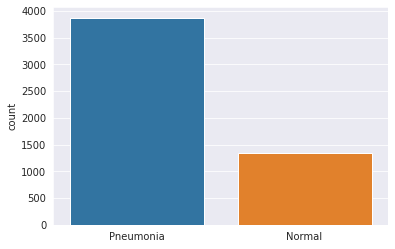

# PneumoniaDetection-Deployment
Using Convolutional Neural Networks and Tensorflow to detect Pneumonia in a patient using their frontal Chest  X-Ray images

# Abstract
This study proposes a Convolutional Neural Network model that detects the presence of Pneumonia in a patient based on his/ her X-Ray images. The model is trained from scratch using Python and different libraries associated with Python, so it separates itself from the already pre-trained models. A chest x-ray is the best test for diagnosing pneumonia. The diagnosis of Pneumonia disease is a human-dependent study. [1]An x-ray exam will allow your doctor to see your lungs, heart, and blood vessels to help determine if the person suffers from pneumonia. When interpreting the x-ray, the radiologist will look for white spots in the lungs (called infiltrates) that identify an infection.  Having a model that detects this presence eliminates the two types of human error, which are Mistakes and Violations.  Once the model is trained with a sufficient number of training images of both Normal and Pneumonia X-rays, then the prediction for a new image is made within a matter of seconds. The trained Convolutional neural network model is then exported as a JSON model for deployment on the browser. The deployment process is done using HTML and Javascript, where the model is first fed into the browser, and then a frontal X-ray image is uploaded for inference. The model predicts if it belongs to the Normal or the Pneumonia positive class.

# Introduction
Pneumonia is a disease that infects the lungs and is caused by bacteria, viruses, or fungi. The early diagnosis of this disease is the key to prevent the spread of pneumonia throughout the body. 
We need a system that detects the presence of this disease at a rate that is as fast as the Radiologists, if not more and something which is easily available to the end-user. In the proposed technique We implement the concept of Artificial neural networks to develop a Machine Learning model which is a computational model that is inspired by the way biological neural networks in the human brain process information. ANN’s have proven to be the breakthrough in the ML industry by portraying their prowess in the fields of Speech Recognition, Computer Vision as well as text processing. 
The input for the model is images of frontal-view of chest X-rays, and it outputs either of the two values, i.e., If the image represents Normal Chest X-Ray or Pneumonia positive X-ray image. The deployment of the model on the browser eases the work of the end-user as he/she just has to upload the chest X-ray image on the browser and the browser will predict the class of the image(Normal/Pneumonia).

# Background
Pneumonia can lead to the death of the infected person, due to the impotence of exchanging gas in the lungs. This disease mainly affects infants and young children and adults over the age of 65. Nearly 4 million people die every year, and as low as 420 million people get infected by this disease. The diagnosis of this disease is very crucial, especially detecting it early. The best method in diagnosing the disease is using X-Ray images of the patients. This diagnosis of Chest X-ray images of the affected patients is done by expert radiologists. Radiology is the study of dealing with X-rays and other high-energy radiation, especially the use of such radiation for the diagnosis and treatment of disease.  The examination of X-Ray images helps in determining if you have any complications related to pneumonia, such as abscesses or pleural effusions (fluid surrounding the lungs). Thus the Radiologists have to diagnose each X-ray image closely, which takes quite some time.
The advancements in Computer Vision along with Deep Learning, has been constructed and perfected, primarily over one particular algorithm, Convolutional Neural Networks. We use Convolutional Neural Networks (ConvNets) to build our model from scratch. A model built from scratch helps fine tune the hyperparameters as per the requirements. Also, training the model from scratch is more efficient in terms of size and training time as there may be less number of layers as compared to any pretrained model trained for more than one purpose. For Instance, the VGG16 Architecture is trained for 1000 different categories. Most of the models built from scratch have a relatively lower accuracy and much higher loss when tested on a dataset that the model has not seen before. Also, there are not many popular models that have been deployed on the web server having a relatively high prediction accuracy that does this detection on a Chest X-Ray images. 

# Dataset
The dataset was found and downloaded from the Kaggle website. The Chest Xray dataset is organized into 3 separate directories: the train directory, test directory, Validation directory and contains sub-directories for each image category (Pneumonia/Normal). So there are a total of 5,863 frontal Chest X-Ray images and 2 categories (Pneumonia/Normal) as positive and negative Pneumonia images respectively.

Fig.1 represents the graph of the number of Pneumonia and Normal images.
For the analysis of chest x-ray images, all chest radiographs were initially screened for quality control by removing some unreadable scans and all low-quality images. Two expert physicians then graded the diagnoses for the images before being cleared for training the AI system. The evaluation dataset was then checked by a third expert in order to account for any grading errors.

The above Graphical representation shows the number of Test Normal and Pneumonia images.
We see that the data here is imbalanced, so we want to augment the training images by applying some transformations to increase the number of examples.

# Data Preprocessing and Augmentation
The training images of Normal Chest X-Ray were much smaller than its Pneumonia counterpart. Thus, the model could overfit because it may not generalize the image of Normal X-ray of training directory. So we need to augment the size of the training directory artificially. Thus to Augment the number of training Normal X-ray images, some preprocessing was done on those images.  

Fig.3  represents the original version of the image, as found in the dataset. Whenever we want to train our model using CNN to recognize images or objects, in general, we want it to detect that image regardless of its size or position in the image. 
The value of each pixel in the image data is an integer in the range [0,255]. For the model to work correctly, these values need to be normalized to the range [0,1]
